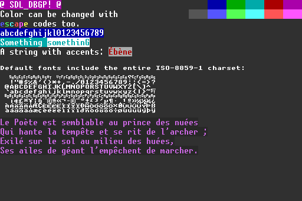

# DBGP

A library to display debug text in SDL2 programs (in a VGA-like text mode). Greatly inspired by [bgfx](https://github.com/bkaradzic/bgfx) debug text API (the provided fonts are from the bgfx project). To install, just include the three files `DBGP.c`, `DBGP.h` and `charset.h` in your project. Example use:

```c
if (DBGP_Init(renderer, DBGP_8X16, sizeof(DBGP_8X16), 8, 16) != 0) {
  SDL_Log("Unable to initialise DBGP: %s", SDL_GetError());
  return 1;
}

DBGP_Print(renderer, 0, 0, DBGP_DEFAULT_COLORS, "Hello world!");
DBGP_Printf(renderer, 32, 32, 0x3f, "Hello %s", "Bobby");

DBGP_Quit();
```

Checkout the example program `example.c`, and build the docs by running `doxygen Doxyfile` in this directory.


